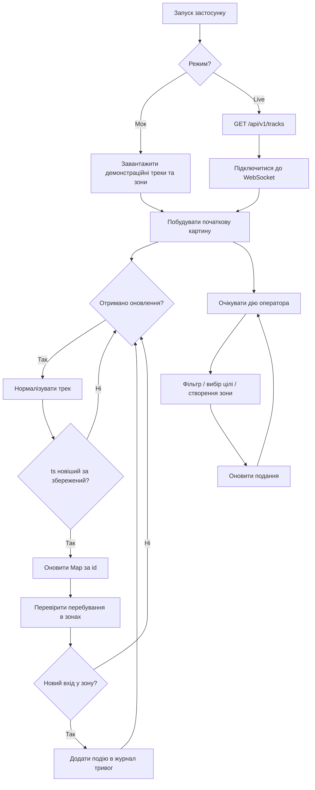

# Діаграма діяльності

```mermaid
flowchart TD
    A[Запуск застосунку] --> B{Режим?}
    B -- Мок --> C[Завантажити демонстраційні треки та зони]
    B -- Live --> D[GET /api/v1/tracks]
    D --> E[Підключитися до WebSocket]
    C --> F[Побудувати початкову картину]
    E --> F

    F --> G{Отримано оновлення?}
    G -- Так --> H[Нормалізувати трек]
    H --> I{ts новіший за збережений?}
    I -- Ні --> G
    I -- Так --> J[Оновити Map за id]
    J --> K[Перевірити перебування в зонах]
    K --> L{Новий вхід у зону?}
    L -- Так --> M[Додати подію в журнал тривог]
    L -- Ні --> G
    M --> G

    F --> N[Очікувати дію оператора]
    N --> O[Фільтр / вибір цілі / створення зони]
    O --> P[Оновити подання]
    P --> N
```
