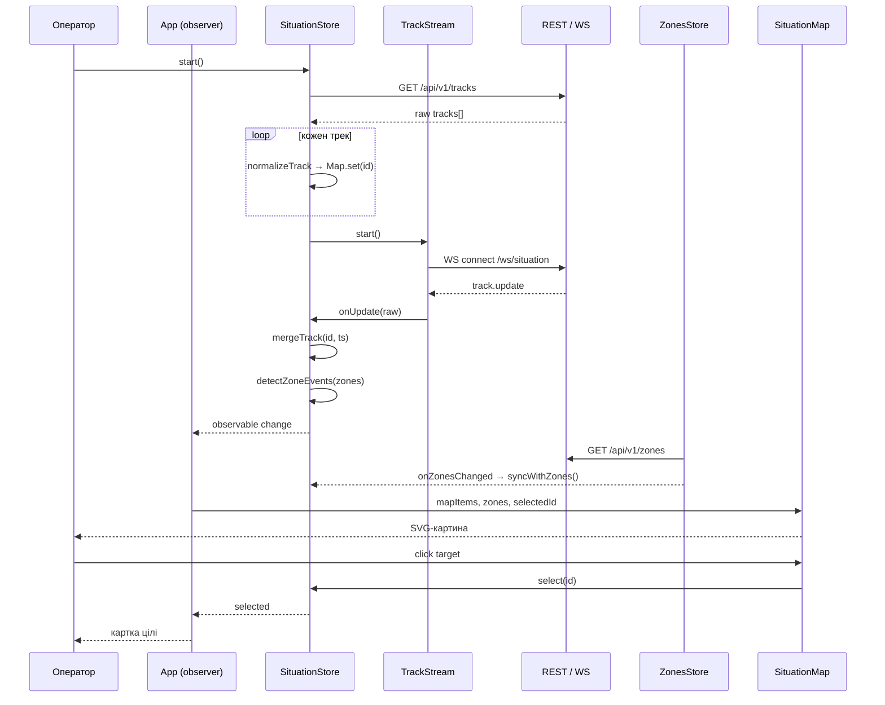

# Діаграма послідовності: оновлення обстановки

```mermaid
sequenceDiagram
    participant O as Оператор
    participant A as App (observer)
    participant S as SituationStore
    participant W as TrackStream
    participant API as REST / WS
    participant Z as ZonesStore
    participant M as SituationMap

    O->>S: start()
    S->>API: GET /api/v1/tracks
    API-->>S: raw tracks[]
    loop кожен трек
        S->>S: normalizeTrack → Map.set(id)
    end
    S->>W: start()
    W->>API: WS connect /ws/situation
    API-->>W: track.update
    W->>S: onUpdate(raw)
    S->>S: mergeTrack(id, ts)
    S->>S: detectZoneEvents(zones)
    S-->>A: observable change
    Z->>API: GET /api/v1/zones
    Z-->>S: onZonesChanged → syncWithZones()
    A->>M: mapItems, zones, selectedId
    M-->>O: SVG-картина
    O->>M: click target
    M->>S: select(id)
    S-->>A: selected
    A-->>O: картка цілі
```
