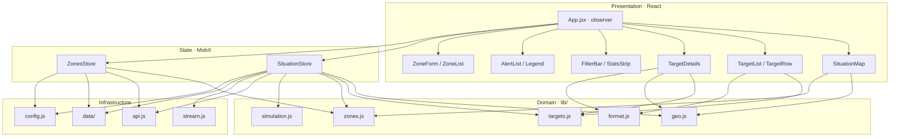

# Компонентна архітектура

```mermaid
flowchart TB
    subgraph UI["Presentation · React"]
        APP[App.jsx · observer]
        MAP[SituationMap]
        LIST[TargetList / TargetRow]
        DET[TargetDetails]
        FIL[FilterBar / StatsStrip]
        ALR[AlertList / Legend]
        ZF[ZoneForm / ZoneList]
    end

    subgraph STATE["State · MobX"]
        SS[SituationStore]
        ZS[ZonesStore]
    end

    subgraph DOMAIN["Domain · lib/"]
        GEO[geo.js]
        TGT[targets.js]
        ZON[zones.js]
        SIM[simulation.js]
        FMT[format.js]
    end

    subgraph IO["Infrastructure"]
        API[api.js]
        STREAM[stream.js]
        DATA[data/]
        CFG[config.js]
    end

    APP --> MAP & LIST & DET & FIL & ALR & ZF
    APP --> SS & ZS
    SS --> GEO & TGT & ZON & SIM
    ZS --> ZON
    SS --> API & STREAM & DATA & CFG
    ZS --> API & DATA & CFG
    MAP --> GEO & ZON
    LIST --> TGT & FMT
    DET --> TGT & GEO & FMT
```
