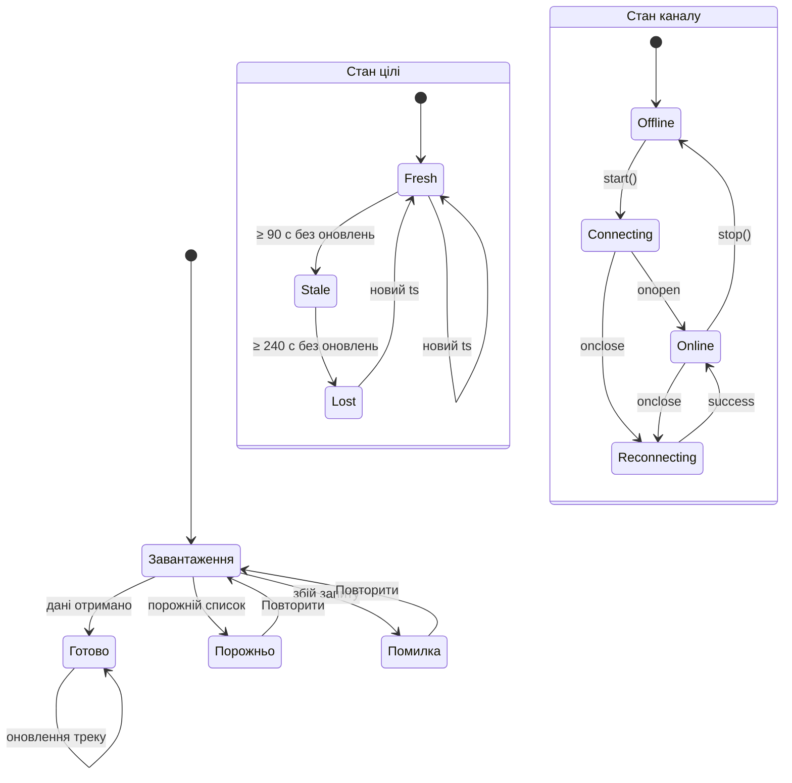

# Діаграма станів

```mermaid
stateDiagram-v2
    [*] --> Loading

    state "Завантаження" as Loading
    state "Готово" as Ready
    state "Порожньо" as Empty
    state "Помилка" as Error

    Loading --> Ready : дані отримано
    Loading --> Empty : порожній список
    Loading --> Error : збій запиту
    Error --> Loading : Повторити
    Empty --> Loading : Повторити
    Ready --> Ready : оновлення треку

    state "Стан цілі" as Freshness {
        [*] --> Fresh
        Fresh --> Stale : ≥ 90 с без оновлень
        Stale --> Lost : ≥ 240 с без оновлень
        Fresh --> Fresh : новий ts
        Lost --> Fresh : новий ts
    }

    state "Стан каналу" as Connection {
        [*] --> Offline
        Offline --> Connecting : start()
        Connecting --> Online : onopen
        Connecting --> Reconnecting : onclose
        Online --> Reconnecting : onclose
        Reconnecting --> Online : success
        Online --> Offline : stop()
    }
```
